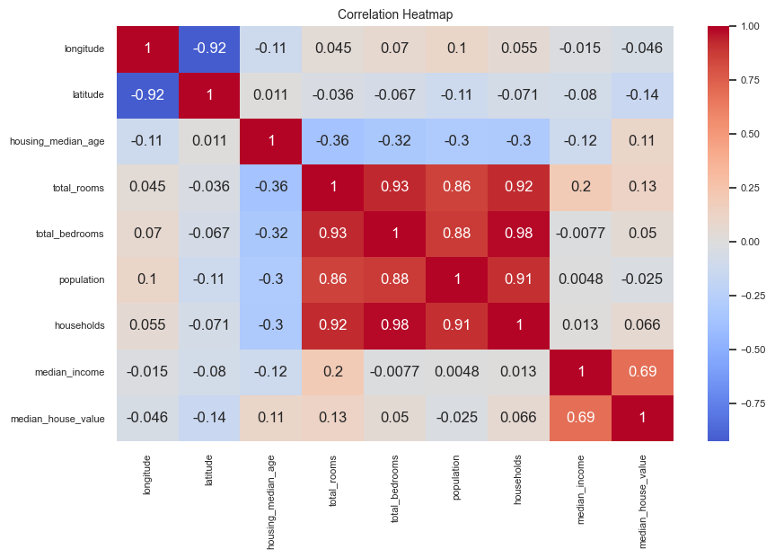
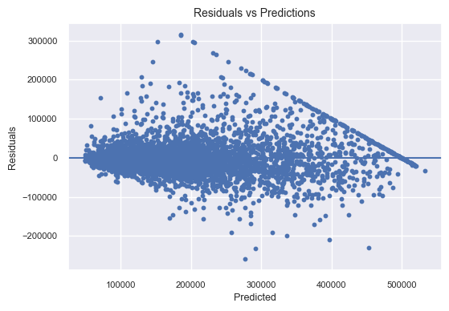

# 🏠 California House Price Predictor

A machine learning project that predicts residential housing prices in California districts. This project analyzes 1990 Census data to identify key drivers of housing value and builds a robust predictive model using Gradient Boosting.

## 📌 Project Overview
The goal of this project is to predict the `median_house_value` for California districts based on various features such as location, occupancy, and income. It covers the full end-to-end Machine Learning lifecycle:
* **Exploratory Data Analysis (EDA):** analyzing distributions and correlations.
* **Data Preprocessing:** handling missing values and categorical encoding.
* **Model Selection:** comparing Linear Regression, Random Forest, and Gradient Boosting.
* **Hyperparameter Tuning:** optimizing the best model for peak performance.

## 📊 The Dataset
The dataset is sourced from the **California Housing** dataset (available on Kaggle/Scikit-Learn). It contains **20,640** entries with the following features:

| Feature | Description |
| :--- | :--- |
| `longitude` / `latitude` | Geographical coordinates of the district. |
| `housing_median_age` | Median age of a house within a block; a lower number is a newer building. |
| `total_rooms` | Total number of rooms within a block. |
| `total_bedrooms` | Total number of bedrooms within a block. |
| `population` | Total number of people residing within a block. |
| `households` | Total number of households, a group of people residing within a home unit. |
| `median_income` | Median income for households within a block of houses (measured in tens of thousands of US Dollars). |
| `ocean_proximity` | Location of the house w.r.t ocean/sea. |
| **`median_house_value`** | **Target Variable:** Median house value for households within a block. |

## 🛠️ Tech Stack
* **Python** (3.x)
* **Pandas & NumPy:** For data manipulation and numerical operations.
* **Matplotlib & Seaborn:** For data visualization (Heatmaps, Histograms, Scatter plots).
* **Scikit-Learn:** For preprocessing, modeling, and evaluation.
    * *Models used:* Linear Regression, Ridge, Lasso, ElasticNet, Random Forest, HistGradientBoostingRegressor.

## 📈 Methodology
1.  **EDA:** * Plotted histograms to understand feature distributions.
    * Created a correlation heatmap to identify strong predictors (e.g., `median_income` showed a high correlation with house value).
2.  **Preprocessing:**
    * Imputed missing values in `total_bedrooms`.
    * One-Hot Encoded the categorical `ocean_proximity` feature.
    * Scaled numerical features using `StandardScaler`.
3.  **Model Training:** * Trained multiple baseline models.
    * Selected **HistGradientBoostingRegressor** as the best performer due to its speed and accuracy on this dataset.
4.  **Evaluation:** * Validated using K-Fold Cross-Validation.
    * Analyzed residuals to ensure no distinct error patterns existed.

## 🏆 Results
The final model (**HistGradientBoostingRegressor**) achieved the following performance metrics on the test set:

* **R² Score:** `0.834` (The model explains ~83.4% of the variance in house prices)
* **RMSE:** `$46,691.66`
* **MAE:** `$30,956.50`

### Visualizations
*(Note: These plots help visualize the model's performance)*


*Figure 1: Correlation Heatmap showing relationships between features.*


*Figure 2: Residuals vs. Predicted values check for homoscedasticity.*

## 🚀 Usage
The notebook includes a custom inference function `predicted_house_price` to easily predict values for new data.

**Example Usage:**
```python
# Import the function and model from the notebook
# (Ensure you have run the training cells first)

prediction = predicted_house_price(
    model=best_model,
    longitude=-122.23,
    latitude=37.88,
    housing_median_age=41,
    total_rooms=880,
    total_bedrooms=129,
    population=322,
    households=126,
    median_income=8.3252,
    ocean_proximity="NEAR BAY"
)

print(f"Predicted House Price: ${prediction:,.2f}")
